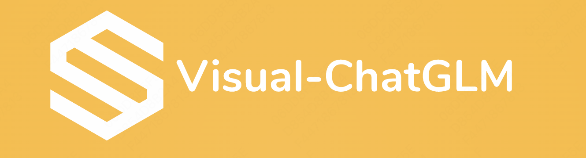

     
      

## 👀 Open ChatGLM Eyes to See the World

This project aims to fine-tune ChatGLM for visual understanding and generation. 
We introduce two designs: (1) how to encode vision content? we concatenate features from CLIP vision encoder to understand vision. (2) how to generate image? instead of calling API like visual-chatgpt, we force model to predict a feature and transforms to image like DALLE2 in an end-to-end manner. 

